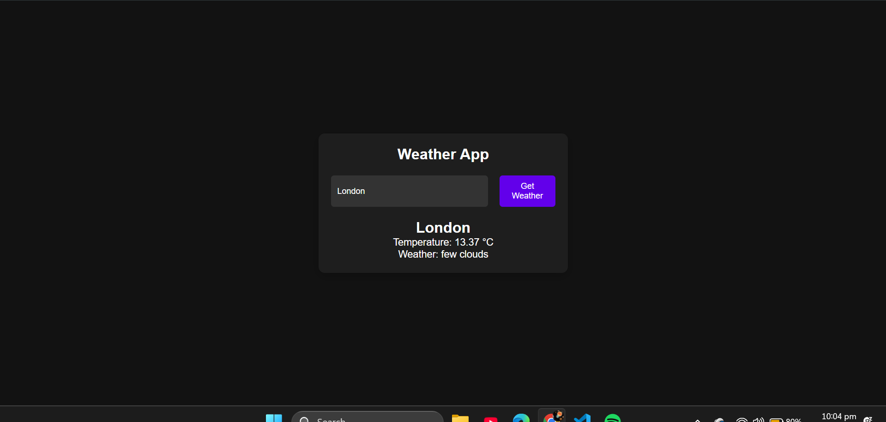

# 💰 Dark Mode Expense Tracker

_A simple, dark-themed expense tracker built with vanilla JavaScript that calculates your total spending and actually remembers your data when you close the tab._

---

## 📌 Table of Contents

- <a href="#overview">Overview</a>
- <a href="#problem-statement">Problem Statement</a>
- <a href="#dataset">Dataset</a>
- <a href="#tools--technologies">Tools and Technologies</a>
- <a href="#methods">Methods</a>
- <a href="#key-insights">Key Insights</a>
- <a href="#dashboard">Dashboard/Model/Output</a>
- <a href="#how-to-run">How to Run this project?</a>
- <a href="#results--conclusion">Results & Conclusion</a>
- <a href="#author--contact">Author & Contact</a>

---

<h2><a class="anchor" id="overview"></a>Overview</h2>

I built this project because I wanted a lightweight, no-nonsense way to keep track of my daily expenses. It’s built entirely with HTML, CSS, and JavaScript. It features a modern dark mode interface (because who doesn't love dark mode?) and uses your browser's local storage, so you don't lose your financial list if you accidentally refresh the page or close your browser.

---

<h2><a class="anchor" id="problem-statement"></a>Problem Statement</h2>

Most finance apps are way too complicated. You have to create an account, navigate through endless menus, and link bank details just to log a simple purchase. I just wanted a quick, distraction-free tool to jot down an expense, instantly see the updated total, and have it waiting for me the next day without any hassle.

---

<h2><a class="anchor" id="dataset"></a>Dataset</h2>

All data is generated by the user and saved securely right in their own browser using the Web Storage API.

---

<h2><a class="anchor" id="tools--technologies"></a>Tools and Technologies</h2>

- **HTML5:** To structure the app.
- **CSS3:** For the dark theme, flexbox layout, and hover effects.
- **JavaScript (ES6+):** To handle the logic and make it interactive.
- **Web Storage API:** Specifically `localStorage` to keep the data saved between sessions.

---

<h2><a class="anchor" id="methods"></a>Methods</h2>

Behind the scenes, the app takes the name and amount you type and dynamically creates new list items on the page. I used a JavaScript array to keep track of the expenses and synced it up with `localStorage` (using `JSON.stringify` and `JSON.parse`).

A fun challenge was calculating the total and handling array mutations. I utilized the `.reduce()` method to dynamically sum the amounts, and the `.filter()` method to accurately remove specific expenses using unique IDs. Furthermore, I implemented event delegation on the parent list to handle the delete buttons efficiently without attaching a listener to every single item!

---

<h2><a class="anchor" id="key-insights"></a>Key Insights</h2>

- I realized how powerful JavaScript array methods are; using `.reduce()` for totals and `.filter()` for targeted deletions makes managing data states incredibly clean and straightforward.
- Using event delegation saved me from attaching individual event listeners to every single delete button, avoiding weird UI bugs as items are added and removed.
- `localStorage` is incredibly powerful for building quick, useful tools without needing to set up a whole backend database.

---

<h2><a class="anchor" id="dashboard"></a>Output</h2>

[]

The final output is a clean, centralized interface. It has input fields for the expense name and amount, an "Add Expense" button, your list of expenses, and a running total at the bottom. When you delete an expense, it is removed and the total automatically recalculates. *(Click the image above to view the live demo!)*

---

<h2><a class="anchor" id="how-to-run"></a>How to Run this project?</h2>

It couldn't be easier:

1. Clone or download this repo to your computer.

```bash
git clone [https://github.com/MujtabaFarooqui7/expense-tracker.git](https://github.com/MujtabaFarooqui7/expense-tracker.git)
```
<h2><a class="anchor" id="results--conclusion"></a>Results & Conclusion</h2>

The result is a fast, responsive, and reliable web tool for tracking spending on the fly. It successfully achieves the goal of providing a frictionless user experience while demonstrating core front-end concepts like state management, DOM manipulation, and local storage integration.

---

<h2><a class="anchor" id="author--contact"></a>Author & Contact</h2>

**Mujtaba Farooqui**

* 💼 [LinkedIn]([https://www.linkedin.com/in/your-profile-url](https://www.linkedin.com/in/mujtaba-farooqui-a06044281/))
* 📧 [Email](mailto:mujtabafarooqui72@gmail.comlin)
* 🐙 [GitHub](https://github.com/MujtabaFarooqui7)

Feel free to reach out, connect, or check out my other projects!
